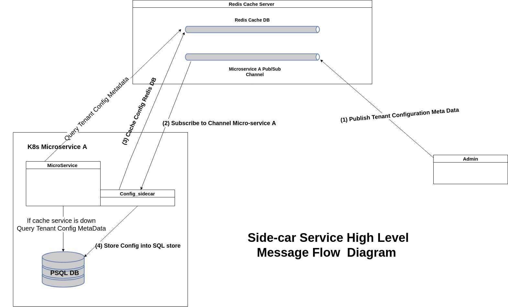

# Config-sidecar

It's k8s sidecar service which will be deployed alongside the primary k8s pod app

* For its initial version the app is built to listen to any tenant metadata configuration changes and persists its corresponding sql and temporary data stores

This means this particular app should be built for each microservice

- Their will be one redis message channel
- The sidecar service will create this channel if it doesn't exist
- Admin module should know each MS config message channel, and it should publish configuration changes into this channels
- the app should build built for each micro services and should be deployed as a k8s sidecar service to each MS pod

## How to build deployable Image for any MS

In the app source their is a reusable docker file
to help build a deployable image for any MS.

**Prerequisites**

The following steps should be taken before building any deployable docker image

- each deployment of sidecar service needs to point to its-own maria-db instance
- A Database should be created , we should also create a db user and assign the new user to be the  owner of the database
- the user should have enough permission to connect remotely and perform basic database operations
- the database IP , the database name and credentials should be passed in the docker file as an env variable

The following are mandatory environment

ENV SERVICE_NAME = _The microservice name OR k8s pod id  where this sidecar services will be deployed_
ENV DB_HOST = _Maria_DB server IP or Host_

ENV DB_PORT = _Maria_DB server port_

ENV DB_NAME = _Maria_DB Database Name (Note that the specified database needs to be created before running any image of this docker file_

ENV DB_USERNAME = _Maria_DB connection username (Note that the specified DB user needs to be created before running any image of this docker file_

ENV DB_PASSWORD = _Maria_DB connection password_

ENV REDIS_HOST = _Redis Server IP or Host_

ENV REDIS_PORT = _Redis Server Port_

**Follow This Simple Steps To Build an Image**

clone and/or checkout master branch https://git.sepa-cyber.com/microservices/wallet/config-sidecar.git

1) Go to the root source folder -> Open `DockerFile txt` and change the environment parameters

2) To build an image just execute

`docker build -t config-sidecar-MSName:latest .`

_MSName_ - being the microservice module name or k8s pod-id

3) migrate the image to the desired deployment node

4) create a container & start the instance
   `docker run imageName`

It's Important to make sure that each IP address and ports which are passed as a parameter to the docker file are accessible to the running docker container#

4) open your browser and check the following URL
   http://<host>:<port>/config/actuator/health

If every thing is fine you will see a json respose which summarizes app's services status

``
{"status":"UP","components":{"db":{"status":"UP","details":{"database":"PostgreSQL","validationQuery":"isValid()"}},"discoveryComposite":{"description":"Discovery Client not initialized","status":"UNKNOWN","components":{"discoveryClient":{"description":"Discovery Client not initialized","status":"UNKNOWN"}}},"diskSpace":{"status":"UP","details":{"total":502468108288,"free":167600648192,"threshold":10485760,"exists":true}},"ping":{"status":"UP"},"redis":{"status":"UP","components":{"publisherRedisConnectionFactory":{"status":"UP","details":{"version":"5.0.7"}},"redisConnectionFactory":{"status":"UP","details":{"version":"5.0.7"}}}},"refreshScope":{"status":"UP"}}}``

## Publishers

- When tenant configuration is changed for a given microservice , the admin module should send each microservice configuration to a Redis Topic
- There should be one topic for each micro-services (This will be taken care of by the side-car service as it will create its respective Redis topic when it starts

- Redis publish channel naming convention is `[service_id]_tenant_config_event_channel`
 where `service_id` is microservice name or k8s pod id

- Valid publish message format is expressed using the following model

`TenantConfigAsyncEvent implements Serializable`

    String tenantId - tenantId
    String metaData - json string of configuration metadata
    String updatedBy - who made the change
    LocalDateTime updatedDate -  when was the change made 
    boolean isDelete - true if the change is a delete operation
**all fields are required**
